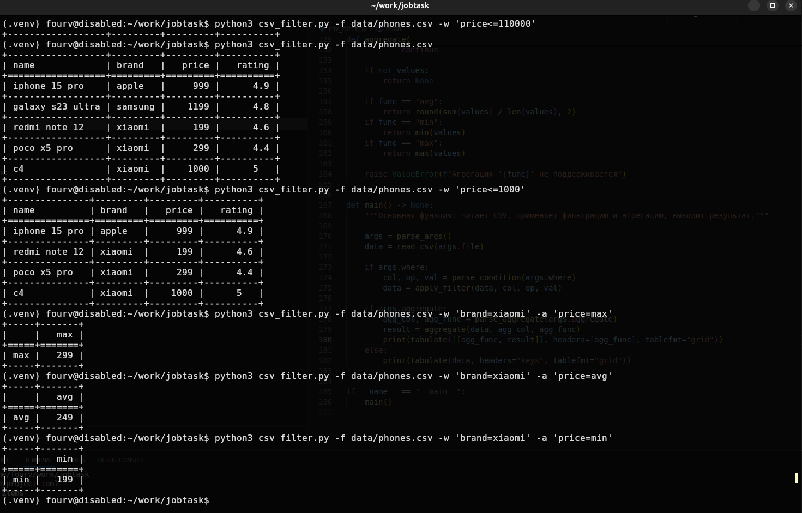

# Обработчик CSV данных

Консольная утилита для фильтрации и агрегации CSV-файлов на Python

## Стек

- tabulate-0.9.0
- pytest-8.4.1

## Возможности

- Фильтрация данных с помощью операторов сравнения (`>`, `<`, `=`, `>=`, `<=`)
- Агрегация данных (avg - среднее, min - минимум, max - максимум)
- Красивый вывод таблиц с помощью `tabulate`
- Юнит-тесты на `pytest`

## Быстрый старт

### 1. Зависимости

- Если используете venv

```bash
python -m venv .venv
```

- Если используете poetry

```bash
poetry install
```

- Обязательно выберите нужный интерпретатор

### 4. Тесты

```bash
pytest tests.py

```

## Пример использования



1. Введите весь функционал.

```bash
python csv_filter.py -f data/phones.csv -h

```

2. Вывод файла csv без фильтрации.

```bash
python csv_filter.py -f data/phones.csv

```

3. Вывод файла csv только c фильтрацией WHERE.

```bash
python csv_filter.py -f data/phones.csv -w "price>500"

```

4. Вывод файла csv c фильтрацией WHERE и агрегацией AGGREGATE.

```bash
python csv_filter.py -f data/phones.csv -w "brand=xiaomi" -a "price=max"

```

---
